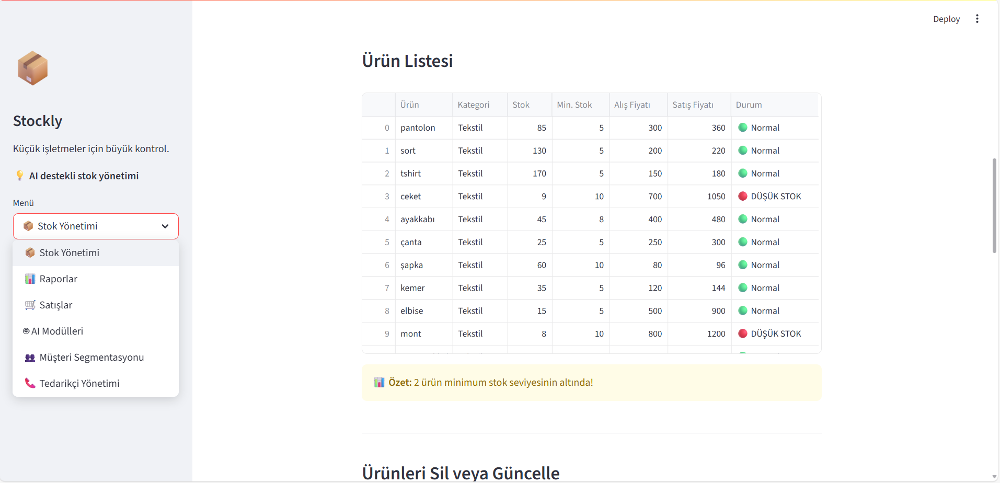

# 📦 Stockly - Smart Inventory Management System

**Big control for small businesses**

Stockly is an open-source, AI-powered inventory management system designed to help small and medium-sized businesses efficiently manage stock, analyze sales, segment customers, and optimize pricing.




## 🚀 Features

### 📦 Inventory Management
- Add, edit, and delete products
- Category-based product organization
- Minimum stock alerts
- Stock level tracking

### 🛒 Sales Management
- Category-based product selection
- Automatic profit calculation
- Detailed sales history
- Filtering and analysis

### 🤖 AI Modules
- **Stock Forecasting:** Predicts when stock will run out using AI
- **Dynamic Pricing:** Adjusts pricing based on demand and trends
- Demand analysis and seasonality detection
- Profit margin control

### 👥 Customer Analysis
- RFM-based customer segmentation
- Region-based customer analysis
- Segment-specific recommendations
- Behavioral analysis

### 📞 Supplier Management
- Manage supplier information
- Category-based supplier matching
- Automatic order generation
- Supplier performance tracking

### 📊 Reporting
- Profit/loss analysis
- Inventory status reports
- Sales trend visualization
- Graphical insights

## 🛠️ Technologies Used

- **Frontend:** Streamlit
- **Backend:** Python
- **Data Analysis:** Pandas, NumPy
- **Visualization:** Plotly, Matplotlib
- **AI/ML:** Scikit-learn
- **Storage:** CSV files


## 📋 Setup Instructions

1. Install dependencies:
```bash
pip install streamlit pandas numpy plotly matplotlib scikit-learn
```

2. Run the application:
```bash
streamlit run app.py
```

3. Open in browser:
```
http://localhost:8501
```

## 🎯 Target Audience

- SMEs (Small and Medium-sized Enterprises)
- Retail stores
- E-commerce businesses
- Any business that manages inventory

## 💡 Advantages

- Easy to use: Intuitive interface  
- AI Powered: Forecasting and smart analytics  
- Cost-effective: Free and open-source  
- Quick setup: Runs in minutes  
- Turkish support: Full Turkish interface  

## 🚧 Future Plans

- [ ] Email campaign system  
- [ ] Mobile application  
- [ ] Multi-user support  
- [ ] Cloud-based storage  
- [ ] API integrations  
- [ ] Product segmentation  
- [ ] Sentiment analysis on reviews  

## 🤝 Contributing

1. Fork this repository  
2. Create a new branch (`git checkout -b feature/new-feature`)  
3. Commit your changes (`git commit -am 'Add new feature'`)  
4. Push to the branch (`git push origin feature/new-feature`)  
5. Create a Pull Request  

## 📄 License

This project is licensed under the MIT License.

## 📞 Contact

- **Project:** Stockly  
- **Slogan:** Big control for small businesses  
- **Version:** 1.0.0
